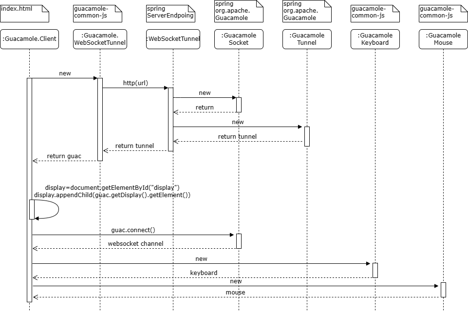

## Guacamole Web

### 项目介绍
Guacamole Web是对Guacamole服务的扩展，利用guacd提供的API接口，通过Web代理websocket或http的通道，使用rpd,ssh,vnc等方式实现对远程机器的无客户端访问。

### 项目功能
Guacamole Web主要目的是为了给裸金属服务机器提供远程Web访问。
云平台使用步骤：
- 在创建裸金属成功后，将裸金属信息(项目ID，用户ID，实例ID，实例hostname, username, password,port, ignore_cert等信息)保存到guacd数据库中；
- 云平台访问裸金属控制台，请求guacamole web，前端html中拼接websocket url并与guaca建立tunnel。

### 项目技术栈
* SpringBoot
* Mybatis-Plus
* Mariadb
* Websocket
* HTML
* JavaScript

### 项目时序图


### 项目组织结构
```
├─src
│  └─main
│      ├─java
│      │  └─com
│      │      └─ict
│      │          ├─config
│      │          ├─constants
│      │          ├─controller
│      │          ├─db
│      │          │  ├─config
│      │          │  ├─dao
│      │          │  ├─entity
│      │          │  └─service
│      │          │      └─Impl
│      │          ├─domain
│      │          ├─service
│      │          │  └─Impl
│      │          └─utils
│      └─resources
│          └─static
│              └─guacamole-common-js
│                  └─modules
```

### 项目部署和启动

```
java -jar springboot-guacamole.jar
或
nohup java -jar springboot-guacamole.jar >log.txt 2>&1 &
```